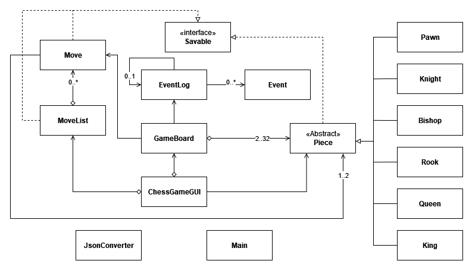

# Personal Project: Working Chess Board

### TODO:
1. Fix undo castling bug
2. Fix undo after game end bug (UI only)
3. Refactor toNotation to be a method of Move objects, rather than MoveList static method.
4. Update comments on logging functions.

## Proposed Functionality

- Display a representation of a chess board (obviously).
- Allow the user(s) to manipulate the board state in accordance to the rules of chess.
- Be able to determine when the game is over; this can be from checkmate, stalemate, 3-fold repetition, or 50 move rule.
- Perhaps in the future, add engine analysis or time control functionality.

### Who would use this application?
Such an application can be used by anyone who may want to play chess, but don't have a chessboard available. In other
words, my application would work the same as any other digital board game.

### Why I chose this project:
I found this project idea interesting as I enjoy playing chess occasionally, so I might find it fun to play with.
A chess board application is very simple in nature, but it does meet all the guidelines for our term project. I believe
that this would be a good project for someone who does not have much experience with Java, but still have enough 
challenges to not feel too trivial.


## User Stories
1. As a user, I want to be able to reset the board to the starting state.
   1. ~~This must be possible only though offering a draw **and** resignation.~~ Since this game is played on a single 
   computer, it would make sense that the board can be reset at any point since both players could determine the winner
   in person.
2. As a user, I want to be able to see a representation of the board.
3. As a user, I want to be able to move pieces around on the board.
   1. Only as allowed by the rules of chess. 
   2. This includes removing a piece from the board when moving to the position of an enemy piece.
4. As a user, I want to be able to see previous moves, preferably both graphically and through chess notation. 
*(This requires adding an X to a Y)*
5. As a user, I want the game to automatically detect checkmate or stalemate positions.
## Phase 2 Stories
6. As a user, I want the choice to save the board at any time.
7. As a user, I want to be given the option to load the previously saved board from a file.
8. As a user, I want there to be multiple possible save slots.

## Phase 3: Instructions for Grader 
- You can generate the first required action related to adding Xs to a Y by running Main.main() and clicking on a white 
pawn or knight. These are the icons on the second row from the bottom of the checkerboard, 
and also the 2 squares from each edge on the bottom most row.
- You can generate the second required action related to adding Xs to a Y by clicking on one of the dots that appear 
on the square after performing the previous step. The selected piece will visually move, and the move will be recorded on the top
right of the window.
- You can locate my visual component by looking at the left half of the window that opens when you run the application.
The chess board does not go away while the program is running.
- You can save the state of my application by clicking the button labelled "Save".
- You can reload the state of my application by clicking the button labelled "Load".
> (Most condescending chess tutorial of all time.)

## Phase 4: Task 2 (Example console log)
```
Wed Apr 05 22:57:30 PDT 2023
Created new board
Wed Apr 05 22:57:32 PDT 2023
Made move: e4
Wed Apr 05 22:57:33 PDT 2023
Made move: e5
Wed Apr 05 22:57:34 PDT 2023
Made move: Nf3
Wed Apr 05 22:57:35 PDT 2023
Undo last move of Nf3
Wed Apr 05 22:57:36 PDT 2023
Made move: Qh5
Wed Apr 05 22:57:38 PDT 2023
Made move: Nc6
Wed Apr 05 22:57:40 PDT 2023
Made move: Bc4
Wed Apr 05 22:57:41 PDT 2023
Made move: Nf6
Wed Apr 05 22:57:42 PDT 2023
Made move: Qxf7+
Wed Apr 05 22:57:42 PDT 2023
Game Over: White Wins By Checkmate
Wed Apr 05 22:57:43 PDT 2023
Undo last move of Qxf7+
Wed Apr 05 22:57:45 PDT 2023
Created new board
Wed Apr 05 22:57:47 PDT 2023
Made move: e4
Wed Apr 05 22:57:48 PDT 2023
Made move: e6
Wed Apr 05 22:57:50 PDT 2023
Made move: d4
Wed Apr 05 22:57:52 PDT 2023
Made move: d5
Wed Apr 05 22:57:52 PDT 2023
Made move: e5
Wed Apr 05 22:57:56 PDT 2023
Made move: f5
Wed Apr 05 22:57:56 PDT 2023
Made move: exf6
Wed Apr 05 22:58:00 PDT 2023
Created new board
```

## Phase 4: Task 3 (Reflection)

From the diagram above, it initially looks like my code is structured and somewhat organized. 
However, there is quite a bit of coupling between classes, and certain functions in classes that can be further subdivided.
Most notably, the Piece class and GameBoard class are *very* strongly coupled together. Moving a piece also requires updating the position of the piece on the board;
pieces stored in GameBoard are organized by their position in a HashMap. Finding the moves of a piece also requires the knowledge of every other piece.
Knowing this, it would be better to separate the GameBoard class into 2 classes, one that handles the game of Chess, and one that handles 
the location of every piece on the board. This second class could be a field of each piece, so functions in the Piece class would not rely on the entirety of GameBoard and would work more independently.

Of course, the prior proposal would require the rewriting of nearly all model package, and would be highly impractical.
A more likely and useful refactoring would be the separation of the GUI with the actual chess game. This would allow me to keep both 
the command line interface (which was recently deleted) along with the current graphic interface, and would make it substantially easier to work on UI improvements.

The last refactoring proposal I can think of would be to change how the data is saved and loaded. Right now, data can be saved
by saving the entirety of MoveList, which requires saving every Move and thus every Piece that made the move. 
This is technically unnecessary, as the only data that is needed to make moves from the starting position of the board to the saved position
are starting and ending squares. This is because it can be assumed that all moves made are legal, and the data of which piece made which move is only
relevant when undoing moves. 
## Board Coordinate System
